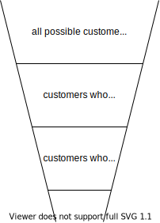

# Internet advertising

Ads are hard to avoid on the internet. Yet its difficult to find somebody who likes them. Somehow it seems like a part of the system -- like taxes. In this series of mini-articles, we will explore the world of online advertising.

## What is advertising?

Lets make sure we understand what *advertising* is. Its simply information about goods or services somebody intends you to use. This information might be in different formats -- picture on a billboard next to a busy road, video within a TV program, a banner on top of a website etc. The common theme is that somebody wants to make you aware of some goods or services that you might use. In order to be effective at communicating the information the first thing an advertiser needs is your attention. The simplest way to do that is to stand out -- flashy lights, bright colors, attractive models, loud sound.

Since advertising at its core is information, its natural habitat is within popular information transmission mechanisms -- TV, radio, newspaper -- we will call these *channels*. Information flows through these channels from the content creator to *consumers*. *Advertisers* pay channels to carry their content to the same consumers.

Channel owner decides what kind and type of content flows through the channel. Advertisers decide which channels to use to send their content. Consumers decide which channels to receive content from.

Lets take an example. Company $C$ manufactures running shoes. They want to reach out to their potential customers to make them aware of the product lineup. There are 2 magazines, $M_{chess}$ publishes articles on chess and $M_{outdoor}$ publishes articles on outdoor activities. Most likely potential customers of $C$ overlap more with the consumers of $M_{outdoor}$ than those of $M_{chess}$. So advertiser $C$ is likely to select channel $M_{outdoor}$ for their ads. This is called *targeting*.
<!-- 
Remember, channels have choices too. $M_{outdoor}$ might decide to not carry the advertisement or charge very high price for it. -->

$C$'s aim is to maximize their sales within an advertising budget. To achive this, they have to ensure they can target potential customers and get them to buy the shoes. This process is traditionally called *funnel optimization* since the number of customers reduce in each step. The accompanying diagram is a simple example; in reality it will have lot more stages; e.g. "customers who saw the ad and decided to vist the store", "customers who saw the ad and decided to vist the store and actually set foot on store".

Notice the construction of the funnel, each step is more restrictive than the preceding through the use of an AND clause (logical conjunction). This construction helps reason about the bottlenecks of the funnel.

<!-- ## How is online advertising different?

Traditionally these mediums are "broadcast" -- i.e. same information being sent to lots of people with no scope for customizing per consumer. So as an advertiser

Most content served on internet are not of this type. Information can be customized per consumer.

This opens up  -->

<!-- * CPM, CPC, CPA -->
<!-- * [Which ad to show — ad auction](ad_auction.html) -->
<!-- * [Second price auction and bidding true value](second_price_auction.html) -->
<!-- * [Shortcomings of second price auction and the comeback of first price auctions](first_price_auction_layers.html) -->
<!-- * [Reserve pricing in ad auctions — hard and soft floors](reserve_pricing.html) -->

<!-- Online advertisement is a major reason behind the fast growth of internet. Think of the internet as a huge information exchange medium — much like how roads are a medium for transportation. But the infrastructure alone is not enough for exchange to happen. For that we need a transaction mechanism akin to trading of goods agiainst money.

Information is hard to price — how much would you be willing to pay to read a news article? How much for one single google search? Its difficult to quantify exactly, but surely the amount is quite small less than $0.01. -->