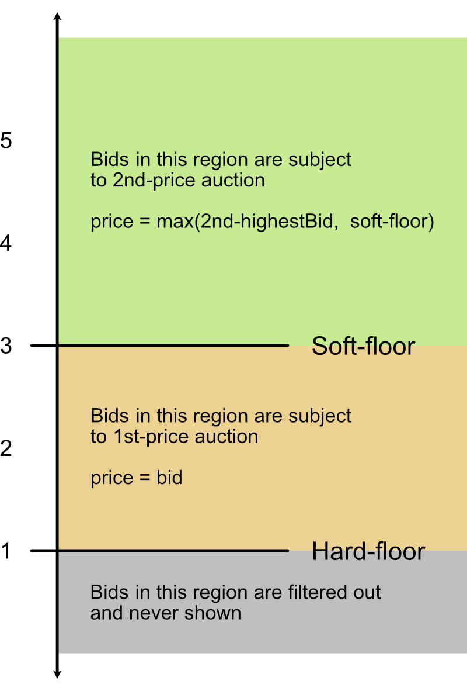

## Reserve pricing in ad auctions — hard and soft floors

The final price decided by auction is purely a function of the bids placed by the buyers. Reserve price is simply the minimum price at which the seller is willing to sell.

placeholder

