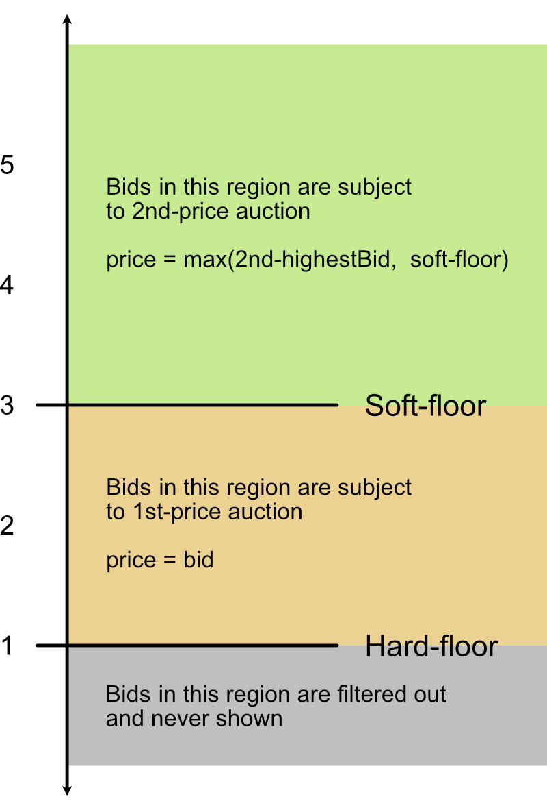

# Hi there, I'm Bigyan Bhar!
> I write about tech stuff that fascinates me.

## Code
JS
``` javascript
function test() {
    console.log("test");
}
```

Python
```python
import sys
print("Hello world")
```

Bash
``` bash
export ABCD="halum"
echo ${ABCD}
```

## Mathjax test

In N-dimensional simplex noise, the squared kernel summation radius $r^2$ is $\frac 1 2$
for all values of N. This is because the edge length of the N-simplex $s = \sqrt {\frac {N} {N + 1}}$
divides out of the N-simplex height $h = s \sqrt {\frac {N + 1} {2N}}$.
The kerel summation radius $r$ is equal to the N-simplex height $h$.

$$ r = h = \sqrt{\frac {1} {2}} = \sqrt{\frac {N} {N+1}} \sqrt{\frac {N+1} {2N}} $$


## Image left-aligned

<div markdown="1">



### some text at top

sometext on side _sometext_ on side sometext on side sometext on side sometext on side sometext on side sometext on side sometext on side sometext on side sometext on side sometext on side sometext on side sometext on side sometext on side sometext on side sometext on side sometext on side sometext on side sometext on side sometext on side sometext on side sometext on side sometext on side sometext on side sometext on side sometext on side sometext on side sometext on side sometext on side sometext on side sometext on side sometext on side sometext on side sometext on side sometext on side sometext on side sometext on side sometext on side sometext on side sometext on side sometext on side sometext on side sometext on side sometext on side sometext on side sometext on side sometext on side sometext on side sometext on side sometext on side sometext on side sometext on side sometext on side sometext on side sometext on side sometext on side sometext on side sometext on side sometext on side sometext on side sometext on side sometext on side sometext on side sometext on side sometext on side sometext on side sometext on side sometext on side sometext on side sometext on side sometext on side sometext on side sometext on side sometext on side sometext on side sometext on side sometext on side sometext on side sometext on side sometext on side sometext on side sometext on side sometext on side sometext on side sometext on side sometext on side sometext on side sometext on side sometext on side sometext on side sometext on side sometext on side sometext on side sometext on side sometext on side sometext on side sometext on side sometext on side sometext on side sometext on side sometext on side sometext on side sometext on side sometext on side sometext on side sometext on side sometext on side sometext on side 

some text at bottom

</div>

## Image right-aligned

<div markdown="1">
<!-- <span> -->


### some text at top

sometext on side _sometext_ on side sometext on side sometext on side sometext on side sometext on side sometext on side sometext on side sometext on side sometext on side sometext on side sometext on side sometext on side sometext on side sometext on side sometext on side sometext on side sometext on side sometext on side sometext on side sometext on side sometext on side sometext on side sometext on side sometext on side sometext on side sometext on side sometext on side sometext on side sometext on side sometext on side sometext on side sometext on side sometext on side sometext on side sometext on side sometext on side sometext on side sometext on side sometext on side sometext on side sometext on side sometext on side sometext on side sometext on side sometext on side sometext on side sometext on side sometext on side sometext on side sometext on side sometext on side sometext on side sometext on side sometext on side sometext on side sometext on side sometext on side sometext on side sometext on side sometext on side sometext on side sometext on side sometext on side sometext on side sometext on side sometext on side sometext on side sometext on side sometext on side sometext on side sometext on side sometext on side sometext on side sometext on side sometext on side sometext on side sometext on side sometext on side sometext on side sometext on side sometext on side sometext on side sometext on side sometext on side sometext on side sometext on side sometext on side sometext on side sometext on side sometext on side sometext on side sometext on side sometext on side sometext on side sometext on side sometext on side sometext on side sometext on side sometext on side sometext on side sometext on side sometext on side sometext on side sometext on side sometext on side sometext on side sometext on side 

some text at bottom
<!-- </span> -->
</div>
